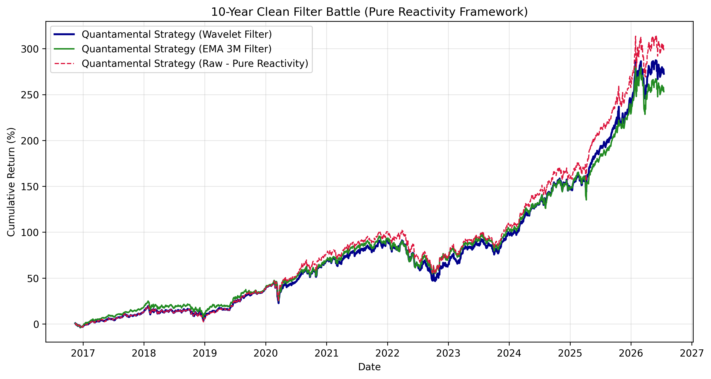

# Quantamental Macro Regime Allocation

A Python-based backtesting framework that evaluates macro regime-switching strategies across a 10-year horizon. The project examines whether noise-filtering techniques, specifically the Discrete Wavelet Transform (DWT) and Exponential Moving Averages (EMA), add statistical value to multi-asset allocation decisions compared to using raw macroeconomic momentum.

## Framework & Asset Allocation
The strategy dynamically rebalances capital among four ETFs (**SPY**, **IEFA**, **TLT**, **GLD**) using macroeconomic data from FRED: the Consumer Price Index (`CPIAUCSL`) and the Industrial Production Index (`INDPRO`). 

To prevent look-ahead bias, all macro data is strictly lagged by 15 days. 

The allocation matrix maps the economy into four regimes based on the crossing of the zero line:
*   **Goldilocks** (Growth ↑ / Inflation ↓): Bias toward Equities
*   **Overheating** (Growth ↑ / Inflation ↑): Equities and Gold
*   **Stagflation** (Growth ↓ / Inflation ↑): Gold and Bonds
*   **Deflation** (Growth ↓ / Inflation ↓): Long-Term Treasuries

We compare three signals to identify these regimes:
1.  **Raw Macro Momentum:** 3-month momentum with no additional smoothing.
2.  **Discrete Wavelet Transform (DWT):** A `db4` level 2 low-pass filter designed to strip out high-frequency noise.
3.  **EMA Filter:** A traditional 3-month (63 trading days) exponential moving average baseline.

## Backtest Results (10-Year Stress Test)

| Strategy | Annualized Return | Annualized Volatility | Sharpe Ratio | Maximum Drawdown | Annualized Turnover |
| :--- | :---: | :---: | :---: | :---: | :---: |
| **Quantamental (Raw)** | **15.06%** | **12.00%** | **0.95** | **-23.26%** | **352.74%** |
| **Quantamental (Wavelet)** | 14.38% | 12.04% | 0.89 | -23.37% | 527.03% |
| **Quantamental (EMA 3M)** | 13.87% | 12.49% | 0.81 | -20.90% | 180.52% |



## Empirical Findings

*   **The Lag Penalty:** Raw signals outperformed both mathematical filters in terms of Sharpe Ratio and absolute return. Because macroeconomic indicators are inherently low-frequency and already delayed by the release schedule, applying additional smoothing techniques introduces operational lag. The filters treat the initial phases of sharp regime switches as temporary noise, delaying the portfolio's rotation.
*   **Drawdown & Turnover Drag:** Denoising via Wavelets did not provide superior downside protection, yielding a Maximum Drawdown (-23.37\%) practically identical to the Raw strategy (-23.26\%). Furthermore, the Wavelet approach caused a heavy structural turnover (527.03\%), which would significantly erode real-world returns through transaction costs.
*   **Conclusion:** In macro-driven systematic frameworks, execution reactivity to raw data trends is structurally superior to post-processing smoothing techniques.

## Prerequisites & Execution
Install dependencies:
```bash
pip install pandas numpy yfinance pandas_datareader PyWavelets matplotlib
